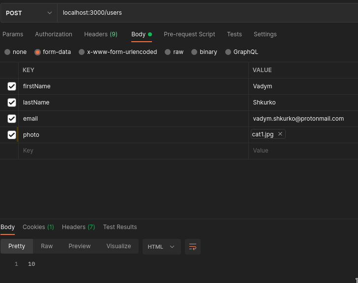
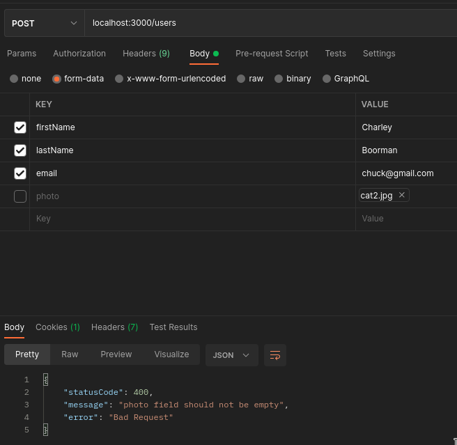
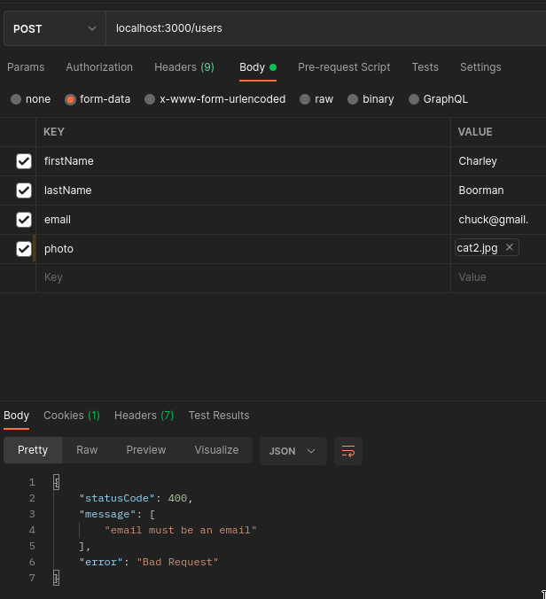
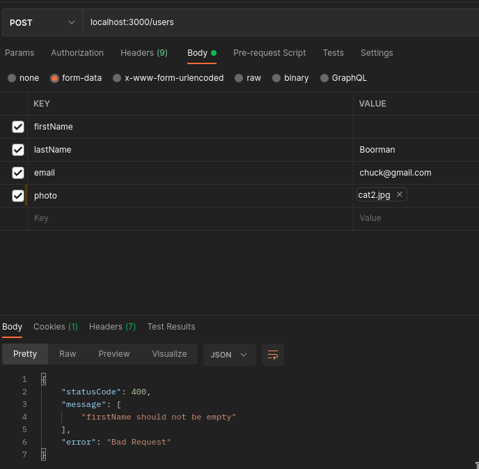
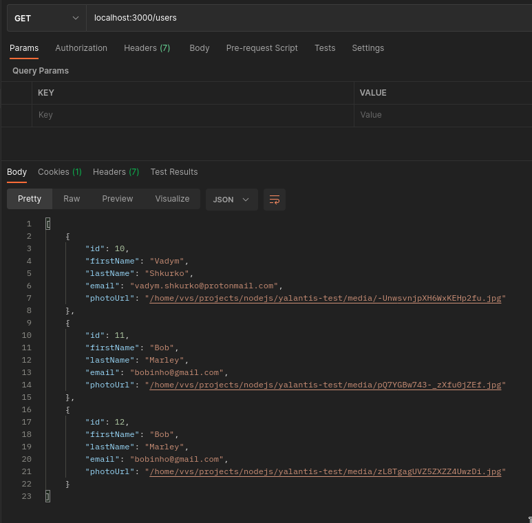
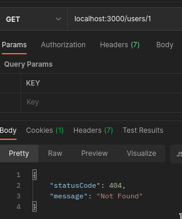
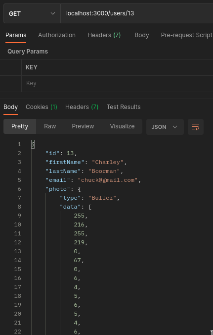

# Yalantis test task

## About my implementation

Application is built using Nest.JS and typescript. I've chosen PostgreSQL with TypeORM as my database setup for this task. To implement image manipulation I've chosen _Sharp_ library.

Validation of input data is managed by `ValidationPipe` and several descriptions of class fields in `CreateUserDTO` class, for example.

Photos are transformed and saved to file system with newly generated file names. These file names are then stored in the database table `user` in the field `photoUrl`. When `findOne` method is called it returns a modified user entity where `photoUrl` is substituted with `photo` of type `Buffer`

However, `findAll` method does not return users with `photo` attribute since reading files for all users might take too long. Therefore, `photoUrl` is among other attributes.

## Routes in the app

```
/users
  GET   - get all users
  POST  - create a user
/users/:id
  GET   - get one user by id
```

## Installation

```bash
$ npm install
```

## Running the app

```bash
# development
$ npm run start
```

## Program was tested using Postman

First, we create our first user by filling all the necessary fields



If we don't include any of the fields, for example `photo`, we get an expected bad request error with an error message



If we leave a field empty or input an email of incorrect format, we also get error





Now we want to get all our users



Let's get that user with id of 1



Ooops, user with id of 1 does not exist in our database! Therefore, we get a 404 http error. Let's try id of 13



Finally, we received a valid user with a mentioned above `photo` attribute of type Buffer.
